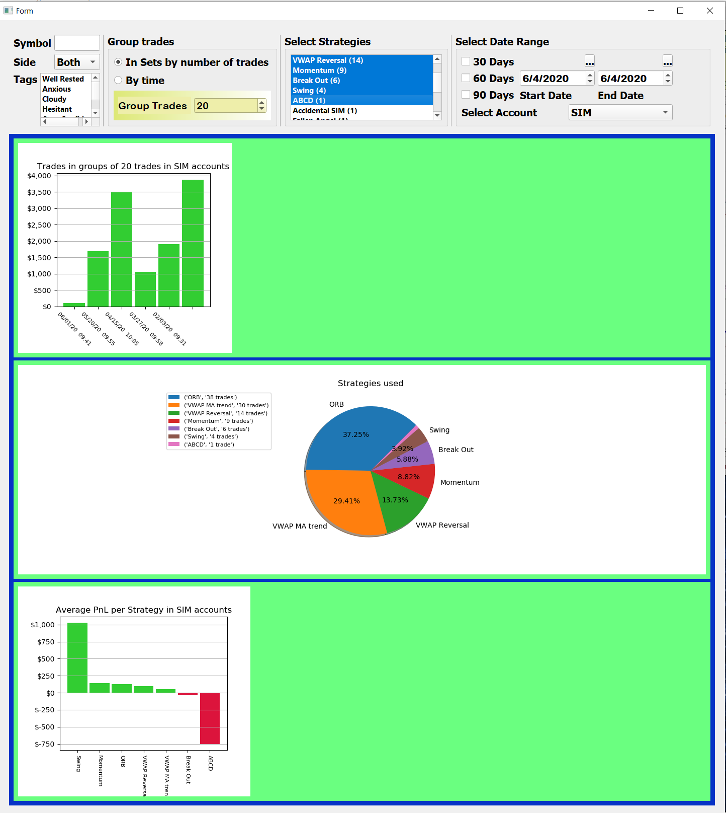
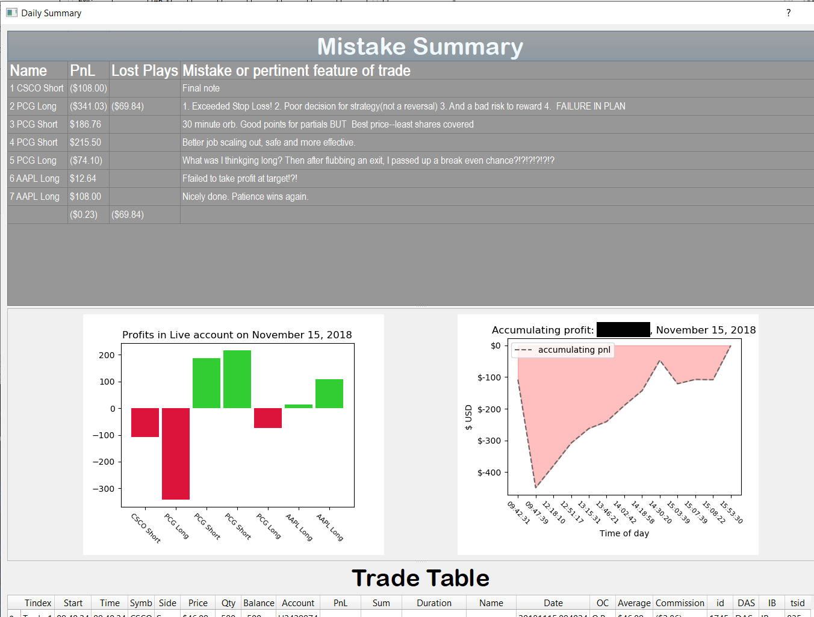
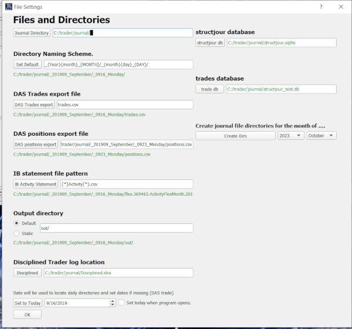
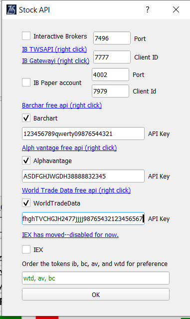
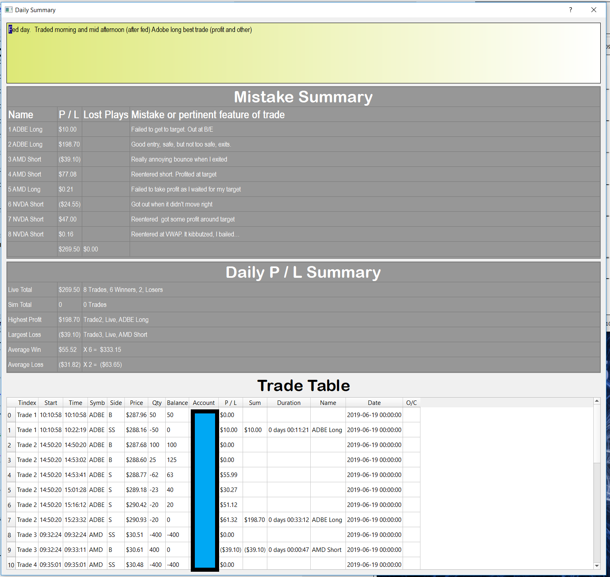
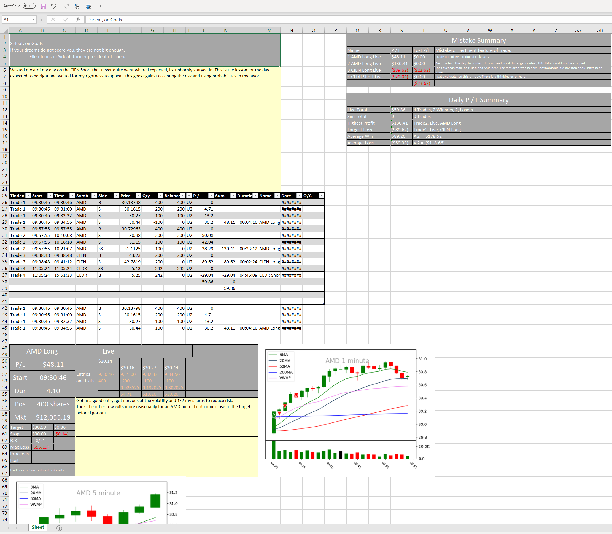
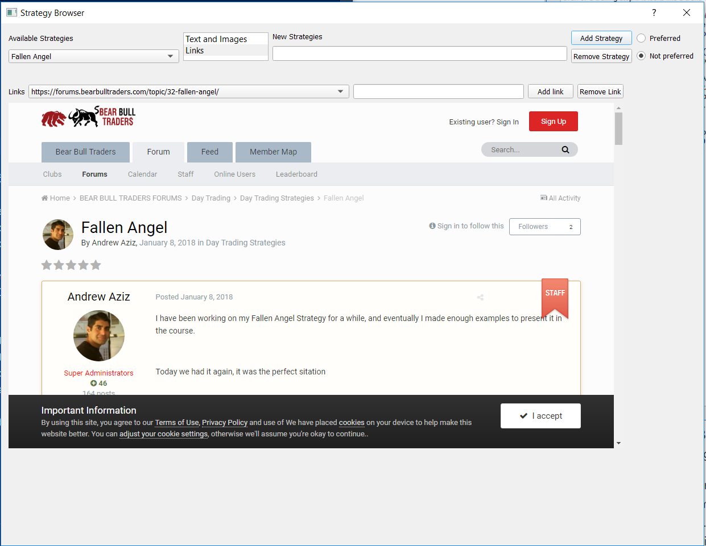
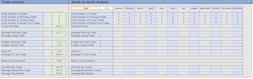

# Structjour - A Structured Daily Journal for Day Traders of Stock Equities
https://github.com/MikePia/structjour

Structjour will import statements from DAS Trader Pro trading platform and Interactive Broker Statements. 

I am very interested in all issues. Please inform me [here. (issues on github)](https://github.com/MikePia/structjour/issues). Uploaded to PyPi its initial pre-release Sept 28 '19.
First concerns are install and run errors. As the sole developer I am anxious to get users' and perspectives on all issues.

Structjour currently reads DAS Trader Pro export files and Interactive Broker Statements
Its pre Alpha. 

## Structjour version 0.9.92-Alpha.003, features a proof of concept statistics hub and a couple charts in Daily Summary

The statistics hub below is a proof of concept. Its accessed through the main menu file->statistics hub. As alwasy, please send suggestions and bug reports. 

I am finding designing the statistics hub very challenging as there are so many possibilities. At this point, I am asking for specific design help. Send suggestions for what charts/layouts would be most useful to you, real day traders...
I will probably implement any examples of charts that are suggested. The current plan is to place them in themed stacked pages, 3 charts per page. Each page will have the user controls for dates, symbols, accounts etc. The emphasis of Structjour is day trading, but the statistics hub should give the longer term view of successful and failing trading activities.

The Daily Summary:

## Installation
Install it in the usual python way from any python enabled shell using python 3.6 or greater.

`pip install structjour`

### How to run Structjour:

After installing, the program will be in your python Scripts directory underneath the directory containing python.exe
 
   `C:\\gs\\python\\python.exe`

   `C:\\gs\\python\\Scripts\\structjour.exe`

You can click on it, set a shortcut or run it from the commandline.

## Initialize file settings
Go to file->file settings

  * Click Journal Directory and select the location to place your journal directory
  * Click on each of the next four buttons to set up defaults
  * Disciplined Trader log (Disciplined.xlsx) is located in your install directory or can be found on [here on github](https://github.com/MikePia/structjour/raw/master/Disciplined.xlsx ). I recommend placing it in your Journal Directory. Then click on Discipline and navigate to the file
   * The "structjour database" and "trades databse" will be sqlite databases. They will be filenames in your system. They can be the same file if you like. Click each of the buttons 'structjour db' and 'trades db' to select a sqlite db or to create a new one.
   * Create Dirs will create subdirectories in your Journal Directory. 
       * Make sure you have a valid directory in the Journal Directory edit box.
       * Make sure you have set the the Directory Naming Scheme (press Set Default)
       * Then select the year and month and click 'Create Dirs'

## Optional setup of automatic chart generation using free data from WorldTradeData, barchart, finnhub and alphavantage

   * Go to file->stock api 

   * Get the barchart apikey [from barchart here](https://www.barchart.com/ondemand/free-market-data-api )
      * Do the registration and copy the apikey into the box
   * Get the Alphavantage apikey [from alphavantage here.](https://www.alphavantage.co/support/#api-key) 
      * Do the registration and copy the apikey into the box
   * Get the WorldTradeData apikey [from WorldTradeData here.](https://www.worldtradingdata.com/register) 
      * Do the registration and copy the apikey into the box
   * Get the Finhub apikey [from Finnhub here.](https://finnhub.io/) 
      * Do the registration and copy the apikey into the box 
   * Select/deselect Barchart, Alphavantage, Finnhub and Interactive Brokers boxes and include/delete tokens 'bc', 'av', 'fh' and 'ib' in the box underneath, seperated by commas. 

## Setup for Interactive Brokers TWSAPI (ibapi)
The free APIs produce excellent charts but are limited to market hours and 7 to 30 days history. If you have an Interactive Brokers account and can receive data from them, this is the best data. It includes afterhours data, does not have a practical limit on the dates for which you can receive data, and has no limits to usage. 
Briefly, to use ibapi you must:
   * Download and install [TWSAPI](https://interactivebrokers.github.io/) 
      * Additionally, you may have to run 'python setup.py install' in the appropriate directory in order to enable it to run with your preferred python executable.
   * While using ibapi, you must have either IB Gateway or Trader Work Staion running. IB Gateway has much less overhead. 
      * [IB Gateway install link](https://www.interactivebrokers.com/en/index.php?f=16457)
      * Configure Ib Gateway. Go to Configure->settings->api->settings
      * fill in (or just note the values) for Socket port and client id
      * Place port and Client ID in the Structjour stockapi dialog -- one setting for live, one for paper
      * Click on Interactive Brokers (live) or IBPaper account
  * Ask ([github issue](https://github.com/MikePia/structjour/issues)) if you have difficulty setting it up.

## How to open your trades in Structjour from DAS Trader Pro
   * Export your trades window from DAS Trader Pro into the folder for the correct date underneath your Journal Dir. 
      * Name the file trades.csv (the default name you selected earlier)
      * Be sure to include the following columns [time, symb, side, price, qty, account, cloid, P / L] 
   * Export your positions window that includes open shares. 
      * Name the file positions.csv
   * In Structjour, select 'DAS import' and the date. The file name should appear in green font indicating it exists.
   * Click Read File,   
      * Add your reviews and charts for each trade. Navigate trades using the combo box.
          * Click update to generate a chart. Right click to copy or browse for a chart.
          * Export to excel if you like. The file will be in [_the dated subdirectory_]/out
          * Export to Disciplined.xlsx if you like. file->Export TradeLog (Open the file and initialize the account number and balance first)

      * Click _Save User Data_ to store your reviews etc in the database (You may have to click it twice.)

 ## The features of the program:

Import from DAS Trader Pro or Interactive Broker Statements. If requested I plan to include other brokers' statements.

Individual trading transactionas are combined into tickets and tickets are combined into trades. Trades are displayed showing ticket entries, exits, PnL, and the diff between initial entry and exit and some other stuff.

A place to enter your initial target and stoploss can detect when the stop is violated and figures the lost PnL. The loss amount can be edited to reflect loss of real or potential PnL due to breaking your rules. 

For your trade review, there is a strategey dropdown to choose from, a location to describe your trade, a location to analyze your trade, and a location to summarize your trade (which will be included in your daily summary).

The strategy dropdown box on the main page can add new strategies to your list. Strategies are supported by the strategy browser where you can define your strategies and check whether to include them in the dropdown box on the front page. In the Strategy browser, you can define your strategy and provide a couple images. Additionally you can add web pages that describe each strategy

Charts can be 1) automatically generated 2) copied from the clipboard or 3) loaded from a file. Data for automatic chart generation has four possible sources. WorldTradeData, Alphavantage and Barchart (free APIs) and Interactive Brokers python API using IB Gateway or Trader Work Station. If you have all four APIS setup, structjour will choose one based on availability and your set preference. The setup for WorldTradeData Alphavantage and Barchart requires you get an API key (very simple and available to everyone). The ibapi data (setup more complicated) has the advantage of providing after hours data and long historical availability. Automatic chart generation can include Moving averages and VWAP. All charts are stored in a directory for that day providing easy access.

Input files are limited to DAS Trader PRO exports and IB statements (Activity, Trade and Flex statements). At some point in the future, other formats will be added.

Navigation between days is done with a date widget. Just Change the date and click read or load to read a new file or load saved data. 

The daily summary has a place to store notes that refer to the whole day. A summary of Wins and losses is displayed that includes the summary made for each trade.

Everything is stored in a light-weight sqlite database

The entire day can be exported to an excel file which includes a trades table, the daily summaries, easy to read forms for each trade and the charts.

All of your trades can be exported to an excel file (a tweak of 'DisciplinedTrader.xlsx) which shows monthly and yearly statistics. 

Excel export. All trades from a day are imported into a single sheet and saved in the out directory for that date
 

Strategy Browser
 

Strategy web browser
 

Export to an excel analysis tool

 

The state of the software is pre-alpha. I created it for my own use based on what I needed. I believe the scope has grown to be more generally useful for Day-Traders of Stock Equities. 

If you are interested in contributing, I would welcome your help and input in any and all areas of design, implementation and bug reports.

